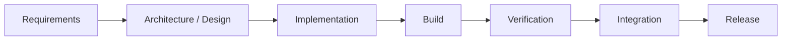
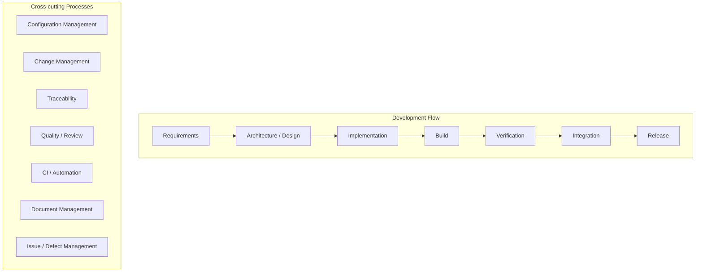
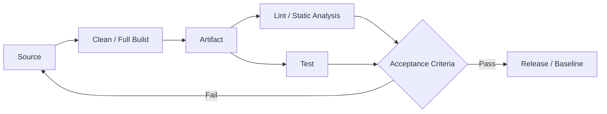
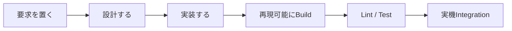

# 組み込みソフトウェア開発プロセス整備

## 1. 目的

開発初期段階において、個別のツールやルールを場当たり的に整備するのではなく、開発全体の流れを定義し、その中にBuild、Lint、Test、CI、成果物管理などを位置付ける。

現段階では、製品・方式そのものが採用されるかを検討している段階であるため、完成された開発プロセスを最初から構築することは目的としない。

まずは以下が一通り回る **Development Process v0.1** の構築を目標とする。



---

# 2. 開発のトッププロセス

組み込みソフトウェア開発の基本的な流れを以下とする。

| Process | 主な内容 | 主な成果物 |
|---|---|---|
| Requirements | 何を実現するか、成立条件を定義 | 要求仕様、要求一覧 |
| Architecture / Design | HW/SW/FPGA構成、責務、Interfaceを設計 | Architecture、設計書、IF仕様 |
| Implementation | ソフトウェア・FPGA等を実装 | Source Code、RTL |
| Build | Sourceから実行可能な成果物を生成 | ELF、BIT、XSA等 |
| Verification | 実装が設計・要求を満たしていることを確認 | Lint結果、Test結果 |
| Integration | HW / FPGA / SWを組み合わせて確認 | Integration Test結果 |
| Release | 正式な成果物を確定・保存 | Release Package、Tag、Release Note |

---

# 3. 開発プロセスを支える横断プロセス

トッププロセスとは別に、開発全体を横断して支える仕組みが存在する。



主な横断プロセスは以下。

| 横断プロセス | 主な役割 |
|---|---|
| Configuration Management | Source、HW、FPGA、Tool、成果物のVersion管理 |
| Change Management | 要求・設計・実装変更の管理 |
| Traceability | Requirement → Design → Code → Test の対応 |
| Quality / Review | Review方法、Lint/Test等の合格基準 |
| CI / Automation | Build、Lint、Test等の自動化 |
| Document Management | 資料・成果物の保存場所と管理方法 |
| Issue / Defect Management | Bug、課題、未解決事項の管理 |

---

# 4. 開発工程 × 横断プロセス

開発プロセスと横断プロセスは、以下のような2軸で整理できる。

| 横断プロセス ↓ / 開発工程 → | Requirements | Architecture / Design | Implementation | Build | Verification | Integration | Release |
|---|---|---|---|---|---|---|---|
| Configuration Management | 要求版管理 | 設計版管理 | Source / Branch | Tool / Build環境 | Test環境版 | HW/FPGA/SW組合せ | Baseline / Tag |
| Change Management | 要求変更 | 影響分析 | 修正 / PR | 再Build | Regression | 再結合試験 | Release変更判定 |
| Traceability | Requirement ID | Req → Design | Design → Code | Build ID | Req → Test | 結合Test対応 | Release対象確認 |
| Quality / Review | 要求Review | Design Review | Code Review | Build基準 | Lint / Test基準 | 結合判定 | Release判定 |
| CI / Automation | - | 文書Check等 | PR Check | 自動Build | Lint / Test | 自動試験 | Artifact生成 |
| Document Management | 要求仕様 | 設計書 / IF仕様 | Coding Rule | Build手順 | Test仕様 / 結果 | 結合試験結果 | Release Note |
| Issue / Defect | 要求課題 | 設計課題 | Bug | Build Error | Test Failure | 実機不具合 | Known Issue |

すべてのセルを実装する必要はない。

開発フェーズ、製品リスク、開発人数などに応じて必要なものを選択する。

---

# 5. 現在実施している作業の位置付け

個別に進めている作業も、上記マトリクスへ配置すると目的が明確になる。

| 現在の活動 | 主な位置付け |
|---|---|
| FPGA Build Script作成 | Build × CI / Automation |
| Clean / Full Build | Build × Configuration Management |
| Cppcheck | Verification × Quality |
| Verilator | Verification × Quality |
| LintのCI実行 | Verification × CI / Automation |
| XSA / BIT等の保存 | Release × Configuration Management |
| Git / PRルール | Implementation × Configuration Management |
| 資料保存場所の整理 | Document Management |
| Lint合格基準 | Verification × Quality |

個々の活動を独立した目的とするのではなく、

**「RequirementsからIntegrationまで一連の開発プロセスを成立させるための構成要素」**

として扱う。

---

# 6. Buildの考え方

日常開発と正式成果物生成を分離する。

| タイミング | Build | 目的 |
|---|---|---|
| 日常開発 | GUI / Incremental等も許容 | 開発速度優先 |
| PR / 結合前 | Script Build | 再現性確認 |
| 正式Build | Clean / Full Script Build | 正式成果物生成 |
| Verification | 正式Build成果物を使用 | Release対象そのものを検証 |

基本的な流れは以下。



重要なのは、

**Testした成果物とReleaseする成果物を一致させること。**

GUIでBuildした成果物をTestし、その後ScriptでBuildし直した別の成果物をReleaseする、という運用は避ける。

---

# 7. Static Analysis / Lint

## 7.1 基本方針

Lint基準は最初から最大限厳しくするのではなく、3段階程度を定義する。

| Level | 位置付け |
|---|---|
| Level 1 | 最低限 / 開発途中 |
| **Level 2** | **標準 / 通常の合格基準** |
| Level 3 | 厳格 / 品質強化時 |

当面は **Level 2** を標準とする。

---

## 7.2 Cppcheck

概念的には以下のように扱う。

| Severity | Level 1 | Level 2 | Level 3 |
|---|---:|---:|---:|
| error | 0 | **0** | 0 |
| warning | 許容 | **0** | 0 |
| portability | 許容 | Review | 0 |
| performance | 許容 | Review | 0 |
| style | 許容 | Review | 0 |
| information | 参考 | 参考 | Review |

Level 2の考え方：

- Error = 0
- Warning = 0
- Style / Performance / Portability = Review対象
- 意図した指摘はSuppress可能
- Suppressには理由を残す

設定イメージ：

```bash
cppcheck \
    --enable=warning,style,performance,portability \
    --check-level=normal \
    --project=compile_commands.json
```

---

## 7.3 Verilator

VerilatorはWarning IDごとに意味が異なるため、プロジェクト側で重要度を分類する。

例：

| 分類 | Warning例 | 基準 |
|---|---|---|
| Critical | LATCH、CASEOVERLAP、PINMISSING等 | **0** |
| Major | WIDTH、UNDRIVEN、CASEINCOMPLETE等 | **原則0** |
| Advisory | UNUSED系、Style系等 | 許容 / Review |

基本実行例：

```bash
verilator \
    --lint-only \
    -Wall \
    --top-module top \
    *.sv
```

意図したWarningについては個別Suppressを許可する。

```text
-Wno-UNUSEDSIGNAL
```

ただし最初から大量にWarningを無効化するのではなく、一度検出した上で、

**「設計上問題がなく、継続的に検出する価値がない」**

と判断したものだけSuppressする。

---

# 8. 開発初期フェーズでの優先順位

現在は、方式・成果物自体が採用される可能性を確認している開発初期段階である。

そのため、すべてのプロセスを同じ深さで整備する必要はない。

| 優先度 | 項目 | 現段階で実施すること |
|---|---|---|
| High | Requirements | 何を実現するか、成立条件 |
| High | Architecture / Design | HW / FPGA / SW構成、Interface |
| High | Implementation | 実装して成立性確認 |
| High | Build | 再現可能なBuild |
| High | Verification | Lint、Test、Acceptance Criteria |
| Medium | Integration | 実機で組み合わせて確認 |
| Medium | Configuration Management | Git、Tool Version、成果物を最低限固定 |
| Low | Change Management | Git / Issue / PR程度 |
| Low | Traceability | 厳密なReq→Design→Test管理は後 |
| Low | Release Management | 採用後に本格整備 |

---

# 9. Change Managementについて

現段階では、正式なChange Managementプロセスを作り込まない。

最低限、

```text
Issue
  ↓
変更
  ↓
Pull Request
  ↓
Review
  ↓
Merge
```

程度で変更履歴が追跡できればよい。

採用が決まり、長期・複数人開発へ移行した段階で、

- Change Request
- Impact Analysis
- Approval
- Regression Test
- Baseline更新

などを追加する。

---

# 10. 2か月程度で目指す状態

目標は完成された開発プロセスではなく、

## Development Process v0.1

を成立させること。



この一連の流れを実プロジェクトで一度通す。

### v0.1のDone条件

- Requirementsが最低限定義されている
- Architecture / Designが残っている
- SourceがGit管理されている
- Build Scriptから再現Buildできる
- Tool Versionが分かる
- Cppcheck / Verilator等を実行できる
- LintのAcceptance Criteriaがある
- Test方法と合格条件がある
- FPGA / SW / HWを組み合わせた確認ができる
- Build / Test結果を保存できる
- 正式成果物を識別できる
- 必要なDocumentの保存場所が決まっている

ここまで到達したら、いったん **v0.1 Complete** とする。

---

# 11. 今後の考え方

初期段階では、

**管理を完成させることより、技術的に成立し、再現でき、品質を説明できること**

を優先する。

```text
Phase 1 : Feasibility / Early Development
    ↓
Development Process v0.1
    ↓
採用判断
    ↓
Phase 2 : Product Development
    ↓
Configuration / Change / Traceability強化
    ↓
Development Process v1.0
```

Lint、CI、Document、Build Scriptなどは、それぞれ単独で完成度を追求すると終わりがなくなる。

そのため、

> 「もっと改善できるか」

ではなく、

> 「Development Process v0.1を成立させるために必要な状態になったか」

を各作業の完了判断とする。

残った改善項目はBacklogへ移し、採用後のProcess v1.0で対応する。
